# Lötanleitung für PCB
Das ist keine allgemeine Lötanleitung, sondern eine Sammlung von Erfahrungen, Tipps und typischen Fehlern beim Aufbau der LED-Tower-Platinen.

Wenn du löten kannst: perfekt.
Wenn nicht: diese Hinweise helfen dir trotzdem, typische Fehler zu vermeiden.

Somit kann dann jeder eine Platine löten und sich damit im Turm verewigen

## Material für eine PCB
- 1x Platinen Rohling
- 8x WS2812D-F5 LEDs
- 2x abgewinkelte einreihige Stiftleiste
- 1x 100Ohm Widerstand

## Weiteres Material
- 4x M3 25mm Spacer
- 10cm Jumper Kabel
- Lötzinn
- Lötkolben
- 5mm LED Abstand Spacer

## Anleitung
Hier steht wie man ohne große Herausforderungen die Platine lötet. Ob8 Humor ist enthalten.

### Voraussetzung
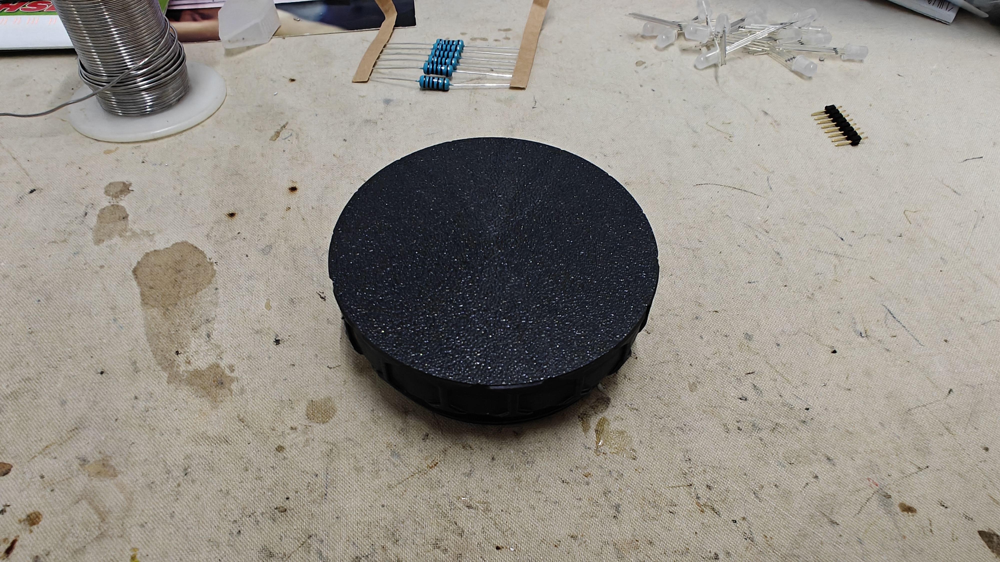

Am besten nutzt man eine Erhöhung, damit man die folgenden Schritte einfacher durchführen kann

### Schritt -1
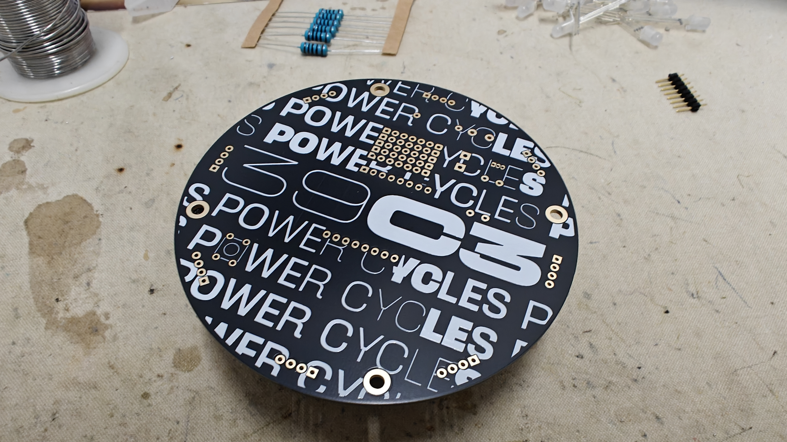

Da liegt er der Platinen Rohling bereit eine weitere Ebene im Tower zu werden.

### Schritt 0
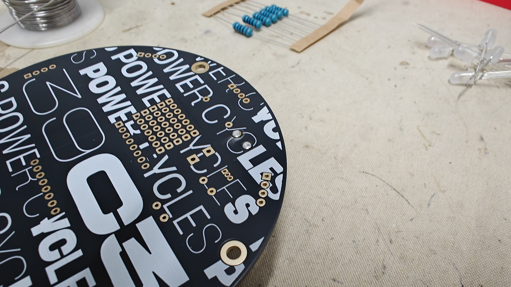

Jetzt werden die beiden abgewinkelten einreihigen Stiftleisten eingelötet..
**Tipp**
Beim Löten ist aufgefallen, dass es am Einfachsten ist, wenn erst die beiden Bohrungen für die Stifte zu verzinnen. Weil sonst oft beim Umdrehen der Platine die Stifte wieder raus gefallen sind und das nervig ist.

### Schritt 1
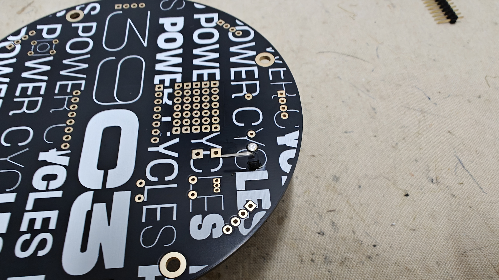

Löte nun den ersten der beiden abgewinkelten Pins ein.
Ich lege hier besonders Wert auf sauber ausgerichtete Pins - das zahlt sich später beim Aufbau des Turms einfach aus.

### Schritt 2
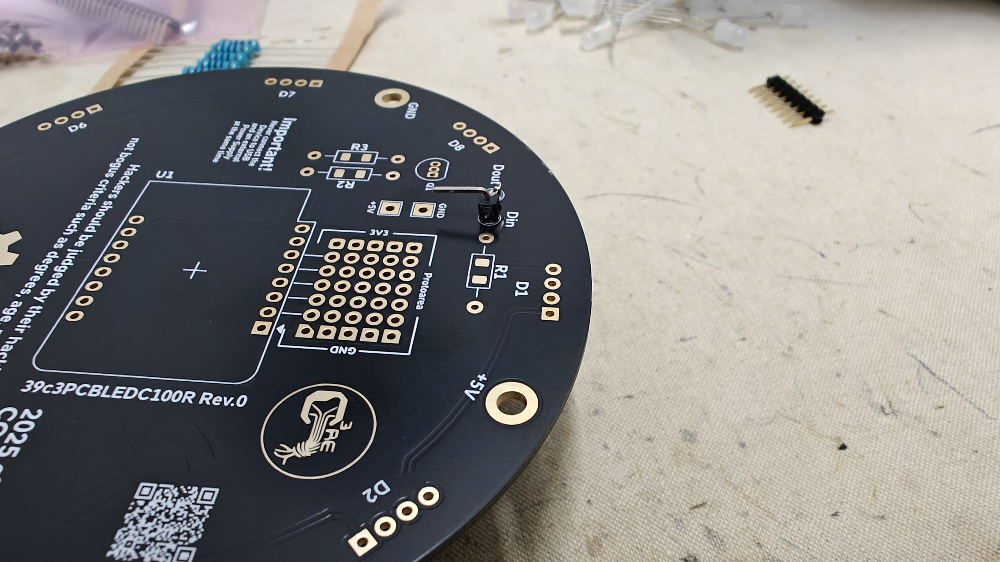

Wie bei Schritt 1 wird jetzt auf der gegenüberliegenden Seite der zweite abgewinkelte Pin eingesteckt und verlötet.

### Schritt 3
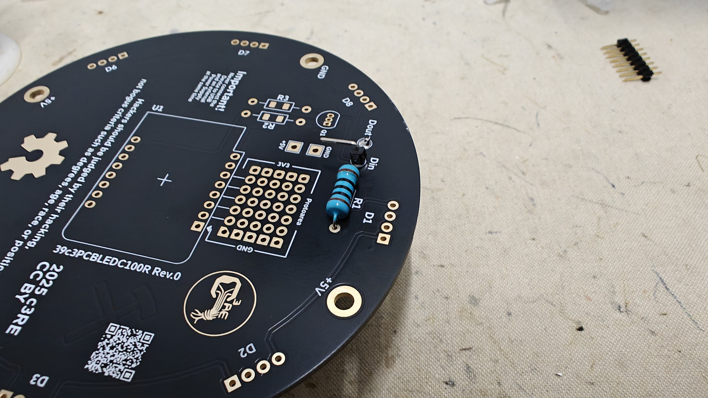

Der 100 Ohm Widerstand wird jetzt auf die Position *R1* eingesetzt. Vorher natürlich noch passend biegen.

### Schritt 4
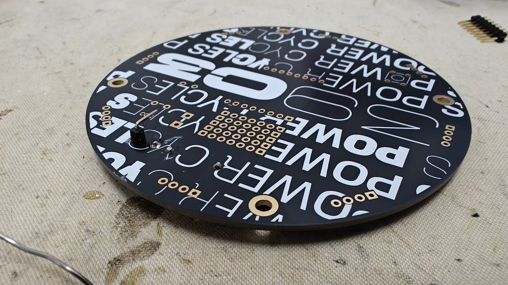

Verzinne nun den eingestecken Widerstand und schneide die überstehenden Beinchen ordentlich ab

### Schritt 5
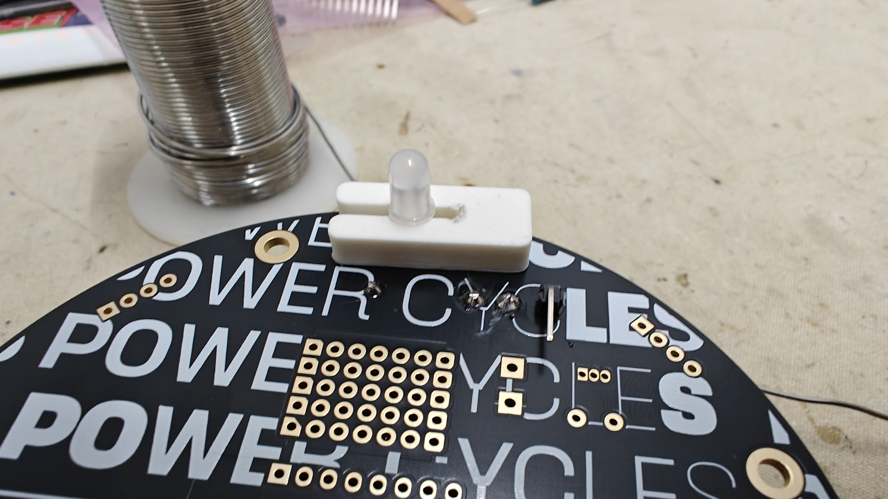

Stecke nun die erste LED ein. Wichtig ist, dass die gerade Seite über dem eckigen vergoldeten Bereich der Platine liegt. Grund ist die jeweilige Polung der LED.
Nutze für einen gleichmäßigen Abstand den 5mm LED Spacer - so haben alle LEDs die kommen einen passenden Abstand.

#### LED Orientierung
Achte unbedingt auf die richtige Ausrichtung der LEDs.

- Die gerade Seite der LED muss zur Markierung auf der Platine passen. Bei dieser Platine ist es ein eckiges Lötpad
- Die Beinchen sind unterschiedlich (Anode/Kathode)

Eine falsch eingesetzte LED funktioniert nicht und muss wieder ausgelötet werden.

Das ist mir bereits passiert. Und es reicht einmal.

### Schritt 6
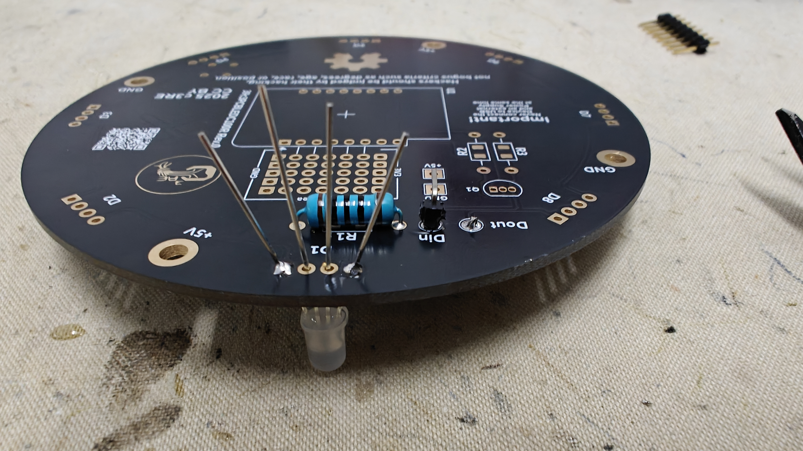

So sieht die verzinnte LED von unten aus. Nach dem Verzinnen kann man nochmal prüfen, ob die LED fest auf dem Abstand liegt und ggf wenn zu locker sie nochmal neu verzinnen. Wichtig ist, dass die Platine auf dem Abstand mit etwas Widerstand liegt - so ist der ideale Abstand gegeben.
Außerdem sieht man hier nochmals die Orientierung der Beinchen.

### Schritt 7
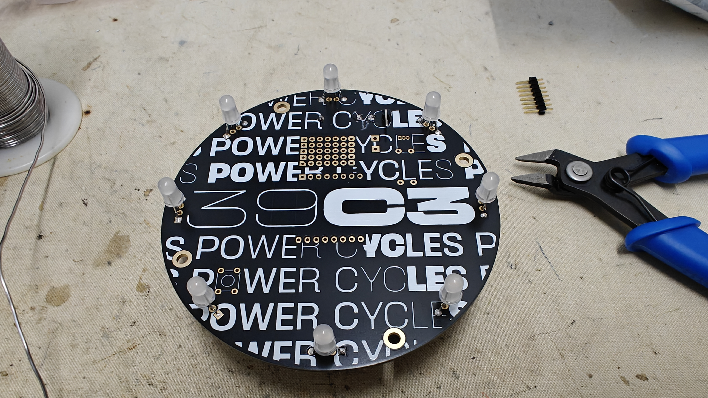

Nach dem einlöten der LEDs sieht es so aus.

Ich habe immer die beiden äußeren Beinchen der LEDs verlötet und dann die nächste eingelötet. Das ist eine subjektive Präferenz man kann auch Alle Beinchen auf einmal verlötet.

### Schritt 8
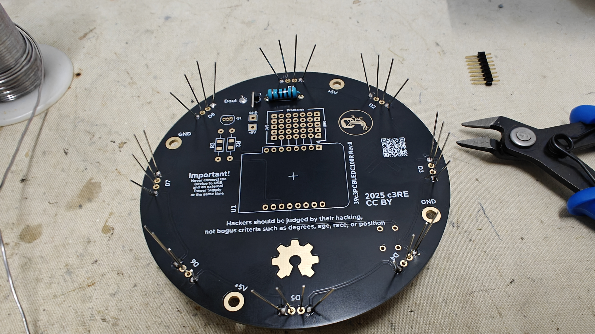

Das ist die Ansicht von unten mit jeweils 2 verlöteten Beinchen je LED.

### Schritt 9
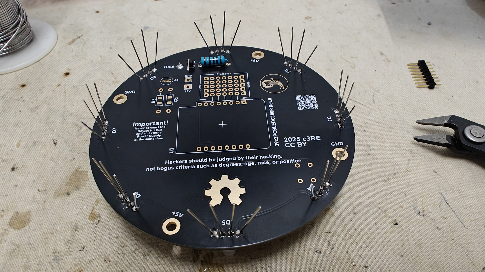

Jetzt sind alle Beinchen mit der Platine verlötet. Im nächsten Schritt werden die Beinchen sauber abgeschnitten und dann ist schon die Platine fertig.

---

Jetzt ist die Platine fertig und kann auf den Turm aufgesetzt werden.
Alternativ kann sie vorher noch mit einem WLED Test Setup getestet werden.